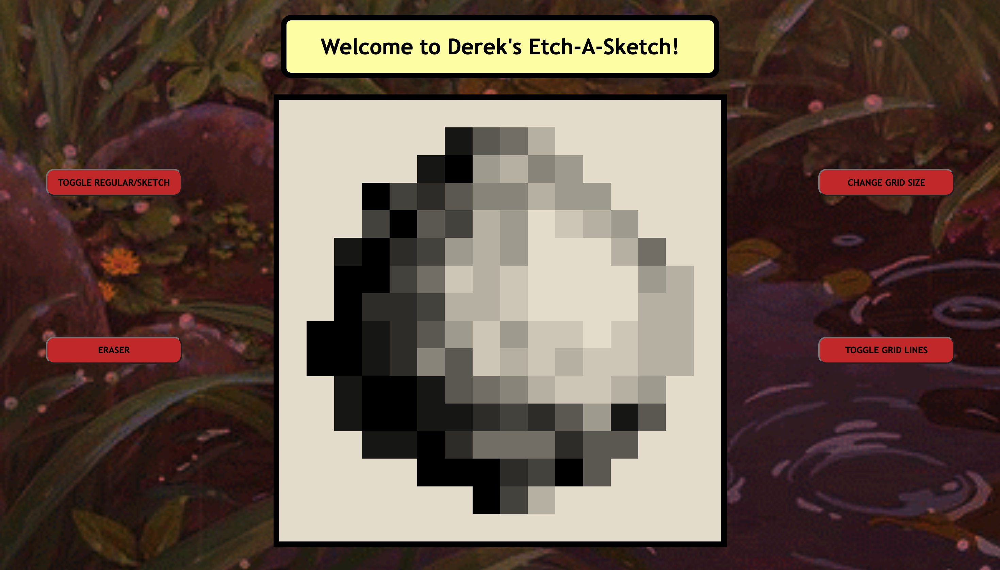

# ETCH A SKETCH
Cross between a sketchpad and an Etch-A-Sketch
- Practice DOM manipulation and JS in general

## HOW TO USE:
- Select an appropriate grid size, maximum size is 100 x 100
- Make sure that you are holding down as well to sketch!

Have fun!
